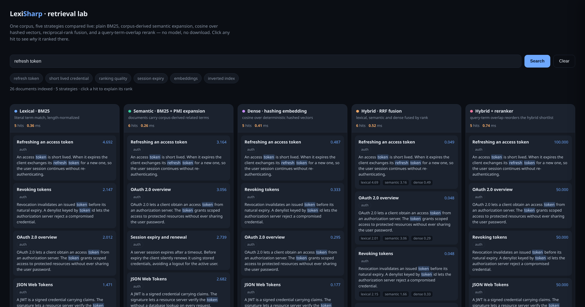

# LexiSharp

A composable information retrieval toolkit for .NET — an in-memory inverted index, four
ranking strategies, rank fusion, reranking, optional PostgreSQL backends, and
**model-agnostic seams** for dense, learned-sparse and neural scoring. The models stay in
your application; the core package references **no NuGet package at all**.

```bash
dotnet add package LexiSharp
```

```csharp
using LexiSharp.Core;
using LexiSharp.Indexing;
using LexiSharp.Ranking;

ITextSearchEngine engine = new RankedTextSearchEngine(
    new InMemoryTextIndex(),
    new Bm25Scorer());

engine.Index(new[]
{
    new SearchDocument("1", "The search engine uses BM25 to rank the results"),
    new SearchDocument("2", "TF-IDF is a classic method of textual search"),
    new SearchDocument("3", "Italian cuisine is renowned in Rome"),
});

foreach (var result in engine.Search("textual search"))
    Console.WriteLine($"{result.DocumentId} - {result.Score:0.###}: {result.Document.Text}");
```

`net10.0`, MIT. Optional packages: `LexiSharp.MessagePack` (binary index persistence),
`LexiSharp.AspNetCore` (a `GET /search` endpoint), `LexiSharp.Postgres` (lexical, vector,
sparse, fuzzy and true BM25 backends).

## See it running

```bash
dotnet run --project samples/LexiSharp.Demo
# → http://localhost:5000
```

Five retrieval strategies over one corpus, compared live — plain BM25, corpus-derived
semantic expansion, dense hashing embeddings, reciprocal-rank fusion and a term-overlap
rerank — with per-lane latency, highlighting and a click-through "why did this rank here?"
panel. No model, no external service.



Clicking a hit also shows the `SearchTrace` chain for that document — the stages it passed
through and the score going in and out of each:


```
score   4.6925 -> 4.6925  BM25
score   3.1642 -> 3.1642  BM25
score   0.4867 -> 0.4867  Dense
merge   0.0492 -> 0.0492  dense=0.4867 lexical=4.6925 semantic=3.1642
rerank  0.0492 -> 100     CrossEncoder(QueryTermOverlap)
```

Each lane states what backs it — the semantic lane uses `PmiTermExpander`, the dense lane a
`HashingEmbeddingProvider`, the rerank lane a local term-overlap `ICrossEncoderScorer` — and
all three are swappable for a real model behind their existing seam. See
[Reference demo](getting-started.md#reference-demo-sampleslexisharpdemo) for the wiring.

Want evidence rather than a demo? The same engines are scored on NFCorpus, SciFact and
ArguAna against BEIR's published BM25 numbers in the
[eval harness](https://github.com/manuc66/LexiSharp/blob/main/bench/LexiSharp.Eval/README.md),
which you can run yourself.

## What is measured, and what is not

Stated up front, because a library that only quotes its good numbers is not worth reading
twice. Every figure below is reproducible with a command on the
[Evaluation](evaluation.md) page.

- **Against published baselines.** On three public BEIR corpora, the plain BM25 scorer
  reaches nDCG@10 **0.308** on NFCorpus, **0.662** on SciFact and **0.289** on ArguAna,
  against BEIR's published **0.325 / 0.665 / 0.315** — 5.2 %, 0.5 % and 8.3 % below. The
  corpora are md5-verified on download and the harness ships no licence over them.
- **Where the composed stack pays off.** On NFCorpus — the one corpus where every lane is
  measured — a dense retriever alone lands at BM25 level (0.304), BM25+dense RRF fusion
  reaches **0.333**, and adding a cross-encoder rerank **0.346**, about 2.1 points above
  BEIR's BM25. Those two lanes are the only ones that use a real model, and the model comes
  from the harness, not from the library.
- **Zero runtime dependencies in the core.** `LexiSharp` references no NuGet package at
  all: index, BM25, every scorer and every decorator are BCL only. The optional packages
  bring their own.
- **Behaviour is specified by tests.** Everything documented here is covered by the xUnit
  suite; the Postgres and ParadeDB integration tests run against a live instance on every
  build and self-skip when `POSTGRES_TEST_CONNECTION` is unset.
- **Not measured, and named rather than glossed over.** The **time** cost of `SearchTrace`
  (its allocation is pinned; the timing was not resolvable on the machine used, so no figure
  is quoted). The **retrieval quality of the SQL backends** — the BEIR harness runs the
  in-memory engines. The **learned-sparse and expansion lanes** on BEIR: no SPLADE model is
  wired into the harness, and corpus-derived expansion is a *loss* where it has been
  measured (0.8469 against BM25's 0.8751 on the reference corpus). **Not every combination**
  of engine, scorer, reranker and merger is exercised by a test.

## Where to go next

| Page | What is in it |
|---|---|
| [Getting started](getting-started.md) | the engine in three lines, the typed `LexiSharpIndex<T>` facade, document loaders, an ASP.NET Core endpoint, the demo app |
| [Indexing](indexing.md) | the inverted index and its statistics, named text fields, the tokenizer and stemming, binary persistence |
| [Querying](querying.md) | metadata filters, pagination, phrase queries, highlighting, prefix & fuzzy terms, synonyms, facets, the span-first API |
| [Ranking](ranking.md) | four scorers, BM25+ / BM25L and their δ tuners, BM25F, score boosting, proximity, per-term explanations — each with the measurement behind it |
| [Pipelines](pipelines.md) | rerankers (MMR, cascade, cross-encoder, MaxSim), hybrid federation, cost-based and intent-based routing |
| [Embeddings and expansion](embeddings.md) | dense, learned-sparse and corpus-derived expansion, all behind consumer-supplied seams |
| [Text analysis](text-analysis.md) | lexical similarity, keyword extraction, Naive Bayes classification |
| [Backends](backends.md) | PostgreSQL lexical / vector / sparse / fuzzy, ParadeDB BM25, what the integration tests cover |
| [Observability](observability.md) | `SearchTrace`, production telemetry, source agreement, calibrated score confidence |
| [Evaluation](evaluation.md) | the BEIR numbers in full, IR metrics, the benchmark CLI, per-query diffs, parameter tuning |
| [Benchmarks](benchmarks.md) | allocations and timings, with the machine they came from and the command to reproduce them |
| [Reference](reference.md) | packages, architecture, scoring conventions, scope and limits, build and test |
| [SPLADE guide](SPLADE.md) | writing a consumer-side `ISparseEmbeddingProvider` around a SPLADE ONNX model |

## Scope

Version 0.5.0, one maintainer, and the public API may still change between minor versions —
pin a version and read the release notes. The techniques implemented (BM25 and its variants,
RRF, SPLADE-style sparse retrieval, MaxSim) follow published information-retrieval
literature; what is here is a small, dependency-free .NET implementation of them, not new
research. [Full scope and limits](reference.md#scope-and-limits).

[Source on GitHub](https://github.com/manuc66/LexiSharp) · [NuGet](https://www.nuget.org/packages/LexiSharp/) · MIT
